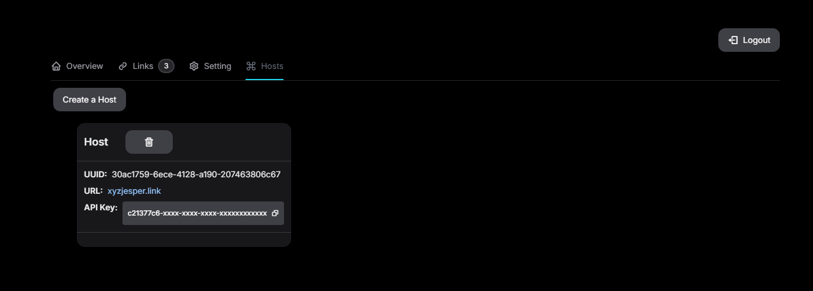

# Create an Host


You need setup your AdminID in the ENV for this Configuration


## Create the Host

<figure><figcaption></figcaption></figure>

* Create a host with the button&#x20;

<figure><figcaption></figcaption></figure>

* Use the URL as your Domain. But please note [#deloy-the-page-with-a-domain](self-host.md#deloy-the-page-with-a-domain "mention") to use your Domain to Setup
* If you have no Domain then you can use your Server IP

